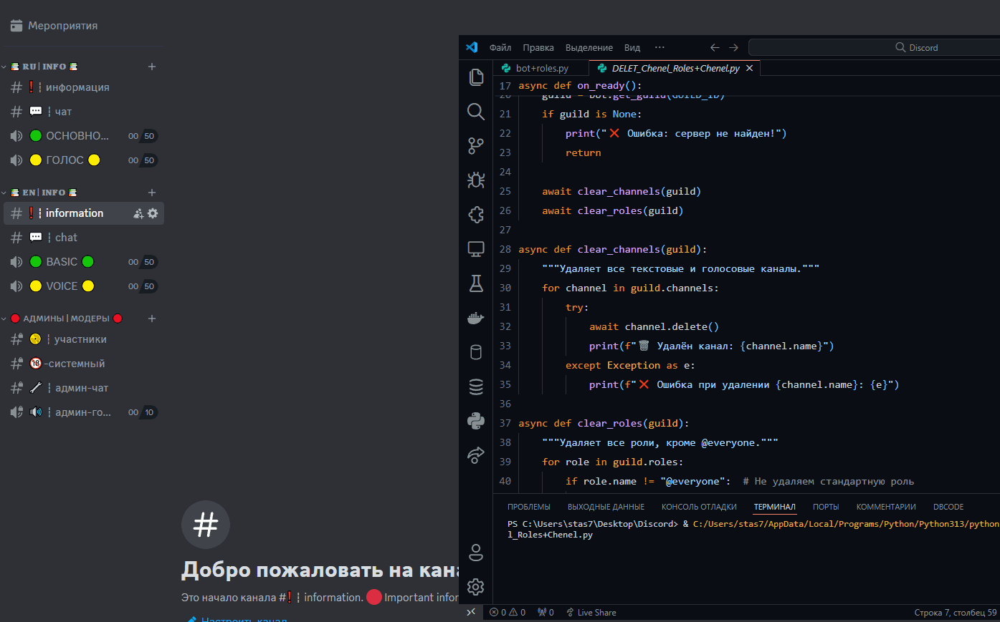

[English](/README.md) | [Русский](/README_ru_RU.md)

<p align="center">
  <picture>
    <source media="(prefers-color-scheme: dark)" srcset="./media/logo-light.png">
    
  </picture>
</p>

<div align="center">

[](https://github.com/AnikBeris)
[](https://github.com/AnikBeris/AutoRoleChannelBot/blob/main/LICENSE)
[](https://github.com/AnikBeris)

</div>

# Discord BOT for Cleaning Channels and Roles

> **Disclaimer:** This project is intended for educational and personal use only. Do not use it for any illegal purposes or in a production environment.

**If you like this project, don't forget to leave a star.**:star2:

<p align="left">
  <a href="https://pay.cloudtips.ru/p/7249ba98" target="_blank">
    
  </a>
</p>

Donations are warmly welcomed no matter how small and thank you very much. 😌

- **Bitcoin (BTC)** - `1Dbwq9EP8YpF3SrLgag2EQwGASMSGLADbh`
- **Ethereum (ERC20)** - `0x22258ea591966e830199d27dea7c542f31ed5dc5`
- **Binance Smart Chain (BEP20)** - `0x22258ea591966e830199d27dea7c542f31ed5dc5`
- **Solana (SOL)** - `yYYXsiVTzsvfvsMnBxfxSZEWTGytjAViE2ojf3hbLeF`


## Features
- Deletes all text and voice channels on the server.  
- Deletes all roles except the default **@everyone** role.  
- Easy setup via `config.json`.  

# Installation

## Clone the Repository
```bash
git clone https://github.com/AnikBeris/Auto-Discord-Cleaner.git
cd Auto-Discord-Cleaner
```

## Install Dependencies
```bash
pip install -r requirements.txt
```

## Run the Bot
```bash
python bot.py
```

## 1. Creating a Discord BOT
1. Go to the [Discord Developer Portal](https://discord.com/developers/applications).  
2. Click **"New Application"**, enter a name, and save it.  
3. Go to **"Bot"** -> **"Add Bot"** -> Confirm.  
4. Copy the bot's **Token** (you will need this later).  
5. Enable **Privileged Intents** (Presence, Server Members, and Message Content).  

<details>
    <summary>🚨 Error: PrivilegedIntentsRequired (Insufficient Permissions)</summary>

# The bot requires privileged intents that are not enabled in the developer panel.
---
## ✅ How to Fix?
### 1️⃣ Enable Privileged Intents in the Discord Developer Portal
  1. Go to the Discord Developer Portal.  
  2. Select your application (bot).  
  3. Navigate to the **"Bot"** tab in the left menu.  
  4. Find the **"Privileged Gateway Intents"** section and enable:  
     4.1. ✅ **"PRESENCE INTENT"** (optional)  
     4.2. ✅ **"SERVER MEMBERS INTENT"** (required)  
     4.3. ✅ **"MESSAGE CONTENT INTENT"** (if message analysis is used)  
  5. Click **"Save Changes"**.  

### 2️⃣ Restart the Bot
  1. Stop the bot (Ctrl + C in the terminal).  
  2. Restart the bot:

```bash
python bot+roles.py
```

</details>

---

## 2. Getting the GUILD_ID
1. Enable **Developer Mode** in Discord (Settings -> Advanced -> Developer Mode).  
2. Right-click on the server name and select **"Copy ID"**. This is your `GUILD_ID`.  

---

## 3. Adding the Bot to a Server
  1. Go to **OAuth2** -> **"URL Generator"**.  
  2. Select **bot** and **applications.commands**.  
  3. In the **Bot Permissions** section, select:  
    - Manage Roles, Manage Channels, Read Messages, Send Messages, Connect, Speak.  
  4. Copy the generated link and paste it into your browser.  
  5. Select the server and authorize the bot.  

---

## 4. Configuration and Launch
  1. Open `config.json` and add your **TOKEN** and **GUILD_ID**.  
  2. Start the bot:
   
```bash
   python bot.py
```
SUCCESS! The bot will start cleaning channels and roles!

<p align="center">
  <picture>
    <source media="(prefers-color-scheme: dark)" srcset="./media/05-info-channel-del.gif">
    
  </picture>
</p>

## License
This project is licensed under the [MIT License](https://github.com/your-repo/blob/main/LICENSE).

---

For detailed documentation, check out the [English README](/README.md) or [Русский README](/README_ru_RU.md).
